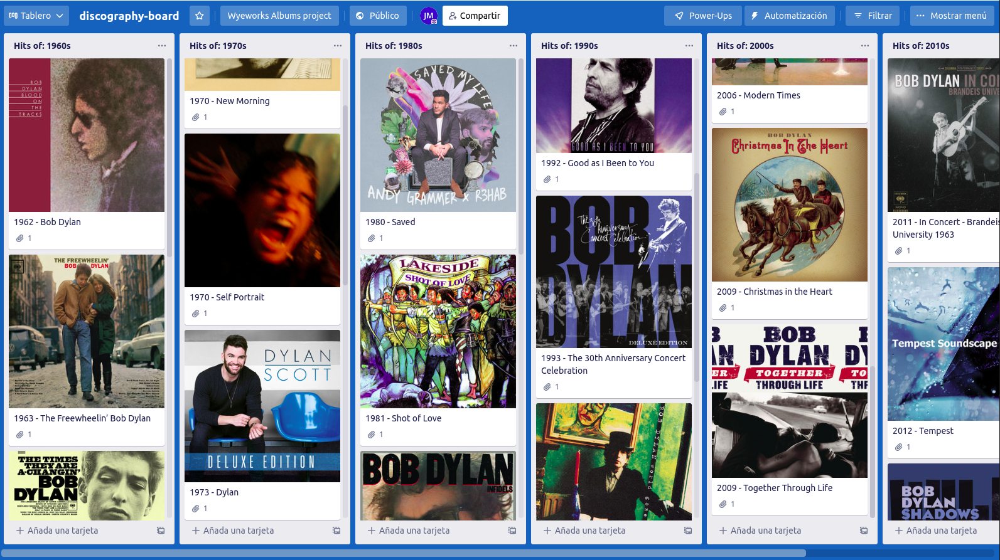

# Discography
An executable process that takes albums information from a file, get the albums pictures from Spotify and posts it to a Trello board.

## Configuration
You'll have to create a file `.env` at the root of the project (in /discography). <br>
This file will contain some environment variables that you need to set to run the project. <br>
Some of them are mandatory and other are optional. <br>
You can run the following command in the root project folder: 
```bash
cp .env.template .env
```
Then, you have to modify the .env file with your credentials and preferences.

## Develop
For running the project in dev-mode you only need `docker` installed on your machine.

### Build and run the image using just docker
First you need to build the docker image by running at the root project dir:
```bash
docker build -t discography .
```

This will build the app and build a docker image with the .jar file ready to run
(It may take some minutes to download all dependencies the first time you build).

Then you can run it:
```bash
docker run --env-file ./.env discography
```

## Final Result:


---


